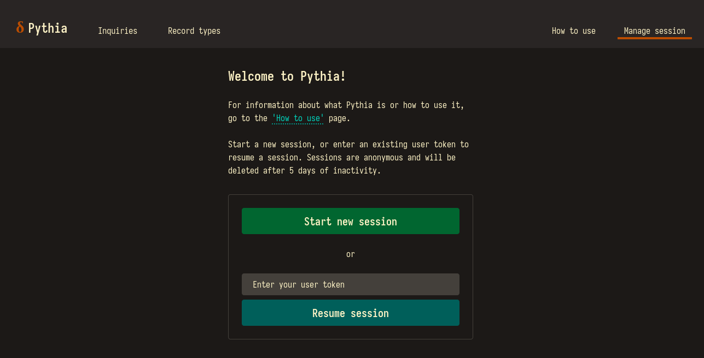
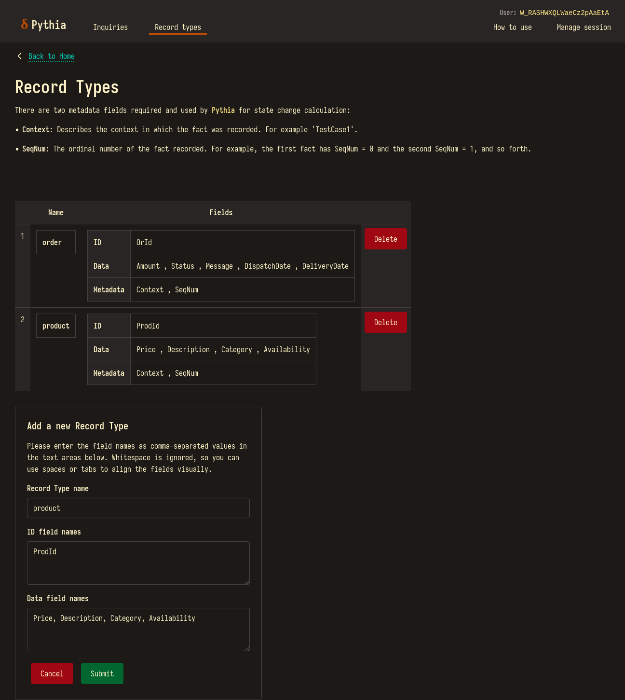
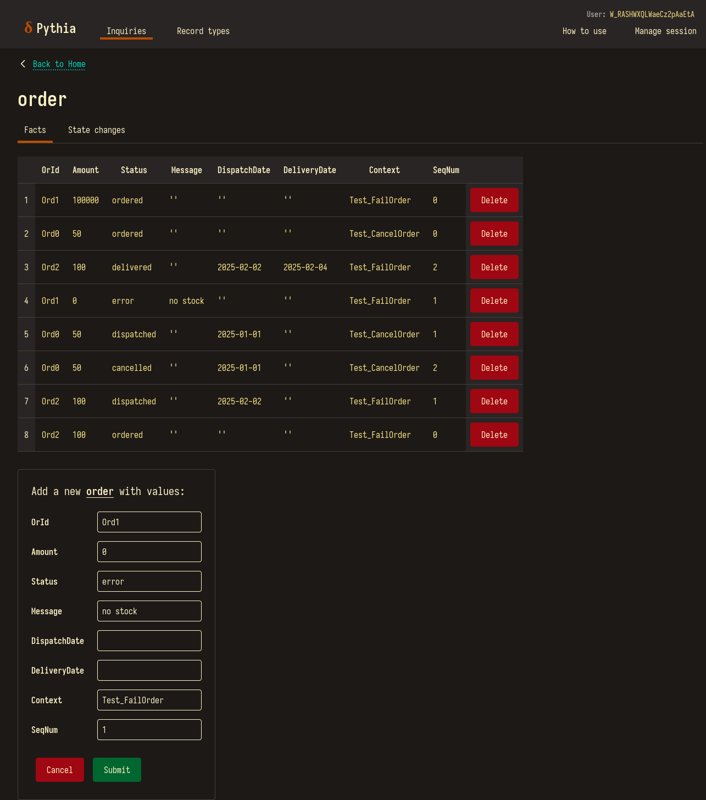
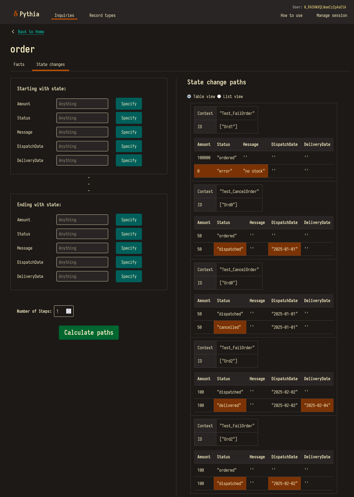
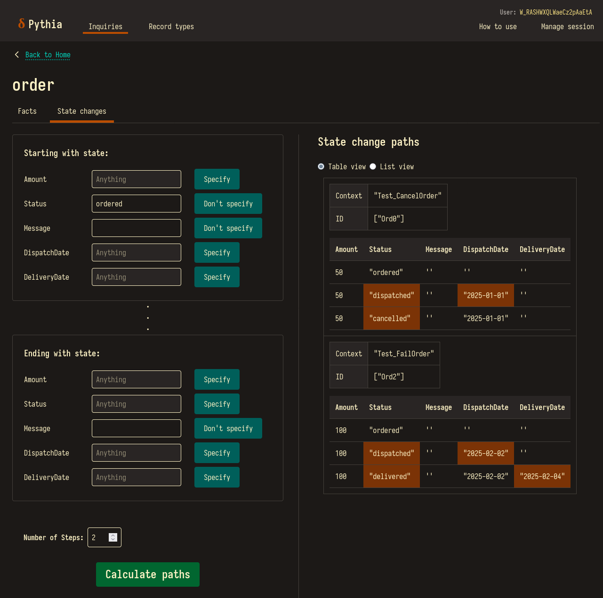

# Pythia

[](https://github.com/jonjau/pythia/actions/workflows/rust.yml)
[](https://opensource.org/licenses/MIT)

Pythia is a novel 'state change explorer' tool built with Rust and [Scryer Prolog](https://www.scryer.pl/).

Run unit tests with database changes tracked in Pythia to help answer questions like:
- How many unique database records of a certain table does Test `T1` change?
- Which tests cover the mutation of field `F`, for example from 'ordered', 'dispatched', then 'delivered'?
- Is state `S` is reachable from state `S'` in the context of Test `T1` or Test `T2`?
- If field `F` changes, do any other fields tend to change with it?
- How many database modifications would it take, to take a database record from state `S` to state `S'`?
- If we were to run the functionality covered by Test `T1` followed by that of Test `T2` on the same database record, what would be the resulting state?

Run completely locally with `docker` or `podman`, or try out the public demo at [pythia.jonjauhari.com](https://pythia.jonjauhari.com) (I don't always keep it running).

## Built with

- Rust and Axum: server for HTML and exposing a REST API, with cookie-based anonymous sessions.
- Scryer Prolog: underlying logic engine for graph reachability calculations.
- Askama: Prolog code generation and HTML templating.
- HTMX, Alpine.js, and TailwindCSS: lightweight web-based UI with barely any JavaScript.
- DynamoDB: single-table database to persist all application data.
- AWS (Fargate), Docker, Terraform, GitHub Actions: continuous deployment workflow.
- Cloudflare: DNS provider.

## How to run

### Run locally with Docker/Podman

At the project root:

```bash
docker compose up
```

Pythia will be running locally and listening on port `3000`. All data will be locally stored in a `.db` file under `dynamodb/`.

### Run locally without Docker/Podman

Linux/Windows binaries for Pythia are available in 'Releases' in this repo.

Some useful environment variables that can be set:

- `PYTHIA_RUN_MODE`: `local` (default if unspecified) or `remote`.
- `AWS_ENDPOINT_URL`: the DynamoDB endpoint to use for persistence. This is required for the `local` run mode, and ignored for `remote` run mode. The regional DynamoDB endpoint is used for the `remote` run mode.
- `RUST_LOG`: the log level; `INFO` is good.

For example you can run the Pythia executable by pointing to a separately running DynamoDB instance on port `8000`:

```bash
AWS_ENDPOINT_URL="http://localhost:8000" RUST_LOG=info ./path/to/executable
```

Or build it directly if you have Cargo installed:

```bash
cargo build && AWS_ENDPOINT_URL="http://localhost:8000" RUST_LOG=info ./target/debug/pythia
```

### Run on AWS

Ensure you have authenticated with the AWS CLI with enough permissions, a Cloudflare API token, and have Terraform installed.

In `infra/bootstrap/`, run `terraform init` and `terraform apply`. This project will setup an S3 bucket that can be used as a backend for the other Terraform projects (and also an IAM role for the GitHub Actions deployment automation).

In `infra/ecr/`, init terraform with a backend (ideally a remote location like S3) then `terraform apply`. This project will set up the ECR repository.

In `infra/`, init terraform with a backend (ideally a remote location as well) then `terraform apply`. This project will set up the actual Pythia application deployment, including:

- ECS: cluster, Fargate service, task definition
- IAM roles: for ECS and the ECS Task
- Networking: AWS Subnets, gateways, route tables, the ALB. The EC2-based [`fck-nat`](https://registry.terraform.io/modules/RaJiska/fck-nat/aws/latest) module is used in place of AWS's managed NAT gateway in order to cut down on running costs. 
- DNS: ACM certificate, Cloudflare DNS records

## Usage

1. Start a session:



2. Add record types (either via web UI or the REST API):



3. Add facts for the records (either via the web UI or the REST API):



4. Calculate state change paths!




There's a few things we can loosely infer:
- `Test_FailOrder` tests 2 unique 'order' records in total.
- Both tests cover the mutation of `Status` from 'ordered' to 'dispatched'.
- Starting from the `Status` of 'ordered' we can reach the `Status` of 'cancelled' or 'delivered'.
- When the `Status` changes to 'dispatched', the `DispatchDate` is set to some date, likewise for 'delivered' and `DeliveryDate`.
- It takes 2 steps to get from `Status` of 'ordered' to 'delivered'.
- We could probably cancel 'Ord2' before it goes to the 'delivered' `Status`. 

## API usage

A roughly-written example JUnit extension can be found in [doc/example/StateChangeLogger.java](doc/example/StateChangeLogger.java).

It won't run, but might give a better idea of the use case above.

So to track database changes and log them to Pythia for a test suite:

```java
    @ExtendWith(StateChangeLogger.class)
    @Test
    void myTest() {
        //... do something with database here
    }
```

### Example payloads

To set the `user_token` cookie on the client, `POST` to `/sessions/resume` with a `user_token` form field set to an existing `user_token`.

Then, to add a record type:

```json
    {
        "name": "order",
        "id_fields": ["OrId"],
        "data_fields": [
            "Amount",
            "Status",
            "Message",
            "DispatchDate",
            "DeliveryDate"
        ],
        "metadata_fields": ["Context", "SeqNum"]
    }
```

and to add facts for that record type:

```json
{
    "facts": [
        {
            "OrId": "Ord1",
            "Amount": "100000",
            "Status": "ordered",
            "Message": "",
            "DispatchDate": "",
            "DeliveryDate": "",
            "Context": "Test_FailOrder",
            "SeqNum": "0"
        },
        {
            "OrId": "Ord1",
            "Amount": "0",
            "Status": "error",
            "Message": "no stock",
            "DispatchDate": "",
            "DeliveryDate": "",
            "Context": "Test_FailOrder",
            "SeqNum": "1"
        },
        {
            "OrId": "Ord2",
            "Amount": "100",
            "Status": "delivered",
            "Message": "",
            "DispatchDate": "2025-02-02",
            "DeliveryDate": "2023-02-04",
            "Context": "Test_FailOrder",
            "SeqNum": "2"
        }
    ]
}
```

## License

Pythia is currently licensed under the terms of both the MIT license and the Apache License (Version 2.0). See [`LICENSE-MIT`](/LICENSE-MIT) and [`LICENSE-APACHE`](/LICENSE-APACHE) for more details.

